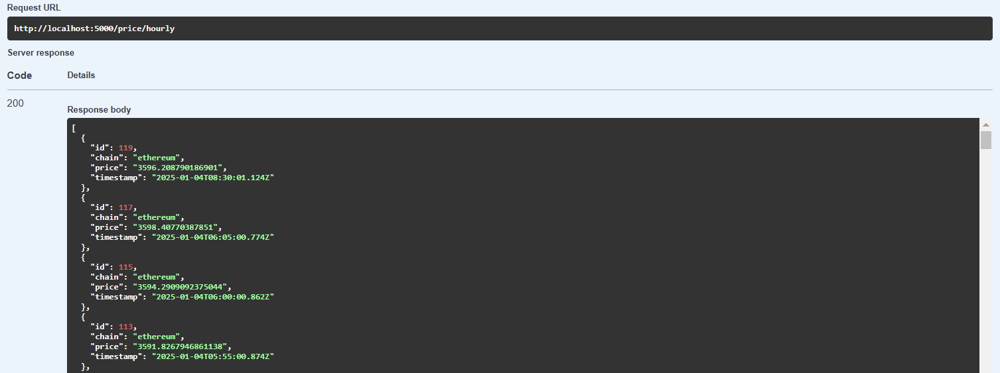
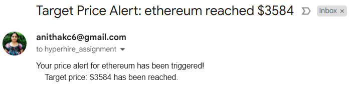

# Crypto Price Monitor

A NestJS application that monitors cryptocurrency prices and sends alerts based on price changes.

## Features

- Real-time price tracking for Ethereum and Polygon
- Email alerts for price increases > 3%
- Custom price alerts
- ETH to BTC swap rate calculator
- PostgreSQL database for price history
- Swagger API documentation

## Prerequisites

- Docker and Docker Compose
- Node.js 16+

## Installation

```bash
git clone git@github.com:anithakc6/price-tracker.git
cd price-tracker
```

## Configuration

Update environment variables in `docker-compose.yml`:

```yaml
environment:
  - DATABASE_HOST=postgres
  - DATABASE_PORT=5432
  - DATABASE_USER=postgres
  - DATABASE_PASSWORD=root
  - DATABASE_NAME=crypto_db
  - MORALIS_API_KEY=your_moralis_api_key
  - SMTP_HOST=smtp.gmail.com
  - SMTP_USER=your_gmail
  - SMTP_PASS=your_app_password
  - SMTP_TO=alert_recipient@email.com
  - WETH_ADDRESS=0xC02aaA39b223FE8D0A0e5C4F27eAD9083C756Cc2
  - MATIC_ADDRESS=0x7D1AfA7B718fb893dB30A3aBc0Cfc608AaCfeBB0
  - WBTC_ADDRESS=0x2260FAC5E5542a773Aa44fBCfeDf7C193bc2C599
```

## Running the App

```bash
docker-compose up --build
```

Access:
- API: http://localhost:5000
- Swagger: http://localhost:5000/api
- pgAdmin: http://localhost:5050 (admin@admin.com/admin)

## API Endpoints

### Price Monitoring
- `GET /prices` - Get 24h hourly prices
- `POST /alerts` - Set price alert
- `GET /swap` - Calculate ETH to BTC swap rate

## Screenshots

### Swagger API Documentation


### Price 


### Swap


### Email Alert



## License

Nest is [MIT licensed](https://github.com/nestjs/nest/blob/master/LICENSE).
